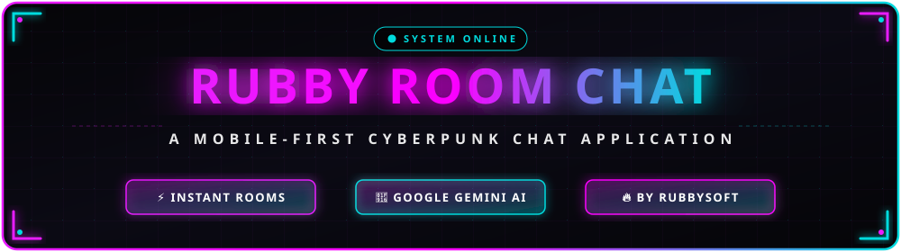
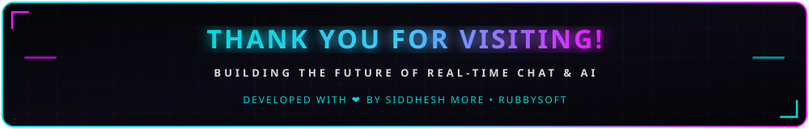

<!-- START BANNER -->
<div align="center">



[](https://git.io/typing-svg)

<!-- TECH STACK BADGES -->
<p align="center">
  
  
  
  
  
  
</p>

<p align="center">
  <a href="#-about-the-project">About</a> •
  <a href="#-key-features">Features</a> •
  <a href="#-screenshots--ui-previews">Screenshots</a> •
  <a href="#-getting-started">Getting Started</a> •
  <a href="#-developers--contributors">Developers</a> •
  <a href="#-about-rubbysoft">RubbySoft</a>
</p>

</div>

---

## 🔮 About the Project

**Rubby Room Chat** is a modern, mobile-first real-time web chat application engineered with a stunning dark-mode cyberpunk aesthetic. Designed for instant connectivity, users can seamlessly generate or join custom chat rooms simply by entering a room name and choosing a username—no complex sign-ups required.

If a room doesn't exist yet, Rubby Room Chat creates it on the fly! Invite friends effortlessly by sharing your unique room link, or engage in intelligent conversations with our integrated **AI Chat Assistant powered by Google Generative AI (Gemini)**.

> [!NOTE]
> **Development Status:** This application is currently in its active development phase. We are continuously refining chat interactions and backend performance to deliver a flawless, high-speed communication experience.

---

## ✨ Key Features

- ⚡ **Instant Room Creation & Joining:** Jump into conversations immediately. Enter any room name—if it exists, you join; if not, a new room is dynamically provisioned.
- 🔗 **Effortless Link Sharing:** Share chat room links directly with friends and colleagues for frictionless one-click onboarding.
- 🤖 **Google Gemini AI Integration:** Built-in smart AI chat powered by `@google/generative-ai` for intelligent automated responses and interactive assistance.
- 🎨 **Stunning Cyberpunk UI:** Premium dark-mode interface featuring vibrant neon pink (`#e81cff`) and cyan (`#40c9ff`) gradients, interactive hover micro-animations, and glassmorphism styling.
- 📱 **Mobile-First Responsive Design:** Optimized for smooth performance across desktops, tablets, and smartphones.
- 🔥 **Real-Time Backend:** Powered by Firebase and Express for reliable messaging and state synchronization.

---

## 📸 Screenshots & UI Previews

> [!TIP]
> **How to replace with your real screenshots:** 
> 1. Take screenshots of your running application (`npm start`).
> 2. Save your images inside the `public/screenshots/` folder (create the folder if needed), naming them `home.png`, `room.png`, `ai.png`, and `about.png`.
> 3. Replace the `https://placehold.co/...` URLs below with your local file paths (e.g., `screenshots/home.png`).

<div align="center">

| 🏠 **Welcome & Home Page** | 💬 **Real-Time Room Chat** |
| :---: | :---: |
|  |  |
| *Vibrant Cyberpunk Welcome Screen with Dynamic Typography* | *Instant Custom Chat Rooms with Username Identification* |

| 🤖 **AI Assistant (Gemini)** | ℹ️ **About & Ecosystem** |
| :---: | :---: |
|  |  |
| *Integrated Smart AI Conversations* | *Comprehensive Developer Details & Social Links* |

</div>

---

## 🛠️ Technology Stack

| Component | Technologies / Libraries Used |
| :--- | :--- |
| **Frontend Framework** | [React 18](https://react.dev/), [React Router DOM](https://reactrouter.com/) |
| **Styling & UI** | Vanilla CSS (Cyberpunk Theme), [Styled Components](https://styled-components.com/), [React Bootstrap](https://react-bootstrap.netlify.app/), React Icons |
| **Backend & Services** | [Firebase](https://firebase.google.com/), [Express.js](https://expressjs.com/), Node.js |
| **Artificial Intelligence** | [Google Generative AI (`@google/generative-ai`)](https://ai.google.dev/) |
| **Utilities & Effects** | Typewriter Effect, Axios, Dotenv |

---

## 🚀 Getting Started

Follow these simple steps to set up and run **Rubby Room Chat** locally on your machine.

### 1️⃣ Prerequisites
Ensure you have [Node.js](https://nodejs.org/) (v16 or higher) and `npm` installed.

### 2️⃣ Clone the Repository
```bash
git clone https://github.com/Siddesh0002T/RubbyRoomChat.git
cd rubby-room-chat
```

### 3️⃣ Install Dependencies
Install all required frontend and backend packages:
```bash
npm install
```

### 4️⃣ Environment Configuration
Create a `.env` file in the root directory and add your Firebase and Google Gemini API credentials:
```env
REACT_APP_FIREBASE_API_KEY=your_api_key_here
REACT_APP_FIREBASE_AUTH_DOMAIN=your_auth_domain_here
REACT_APP_FIREBASE_PROJECT_ID=your_project_id_here
REACT_APP_GEMINI_API_KEY=your_gemini_api_key_here
```

### 5️⃣ Run the Application
Launch the development server:
```bash
npm start
```
Open [http://localhost:3000](http://localhost:3000) in your browser to experience **Rubby Room Chat**!

---

## 🤝 Developers & Contributors

This application is crafted with passion by experienced full-stack and mobile developers:

<div align="center">

| **Siddhesh More** | **Yuvraj Chaudhari** |
| :---: | :---: |
| Full Stack Web Developer • Diploma in Computer Eng. | Full Stack & Android Dev • Campus Ambassador at E-Cell IIT Bombay |
| 🌐 [Portfolio](https://siddhuu.vercel.app/) • 💻 [GitHub](https://github.com/siddesh0002t) | 💻 [GitHub](https://github.com/YUVRAJ007137) • 👔 [LinkedIn](https://www.linkedin.com/in/yuvraj-chaudhari-72a9072a0) |
| 📧 [Email](mailto:siddeshmore145@gmail.com) • 📸 [Instagram](https://instagram.com/siddhesh0002t) | 📧 [Email](mailto:yuvrajsc42@gmail.com) • 📸 [Instagram](https://instagram.com/yuvraj_chaudhari_007) |
| 👔 [LinkedIn](https://www.linkedin.com/siddhesh0002t) | 📞 +91 9699674627 |

</div>

---

## 🏢 About RubbySoft

**RubbySoft** is dedicated to developing user-friendly, innovative, and visually immersive software solutions. Our mission is to provide seamless digital experiences through cutting-edge applications.

- 🌐 **Official Site / Bio:** [rubbysoft.co](https://instagram.com/rubbysoft)
- 📧 **Email Us:** [rubbysoft.co@gmail.com](mailto:rubbysoft.co@gmail.com)
- 🐙 **GitHub Organization:** [RubbySoft](https://github.com/rubbysoft)
- 📸 **Instagram:** [@rubbysoft](https://instagram.com/rubbysoft)

---

## 📜 License

This project is licensed under the **MIT License** - see the [LICENSE](file:///e:/GitHub/rubby-room-chat/LICENSE) file for details.

---

<!-- END BANNER -->
<div align="center">



<p align="center">
  Made with ❤️ by <b>Siddhesh More</b>, <b>Yuvraj Chaudhari</b> & <b>RubbySoft</b>
</p>

</div>
